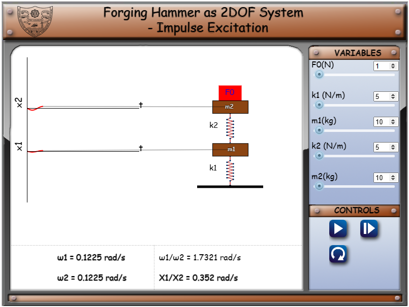
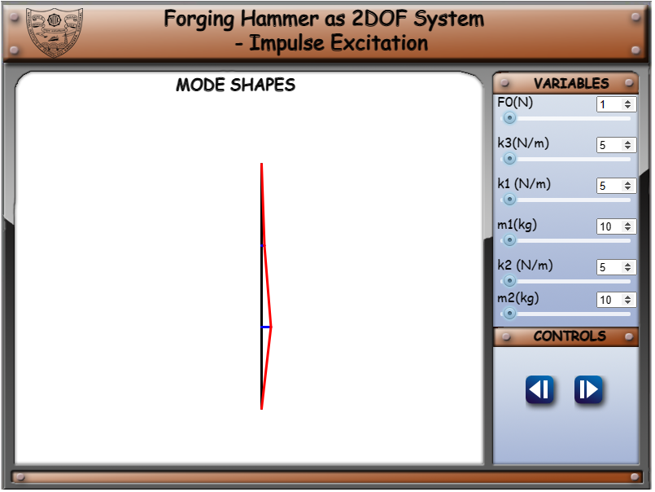
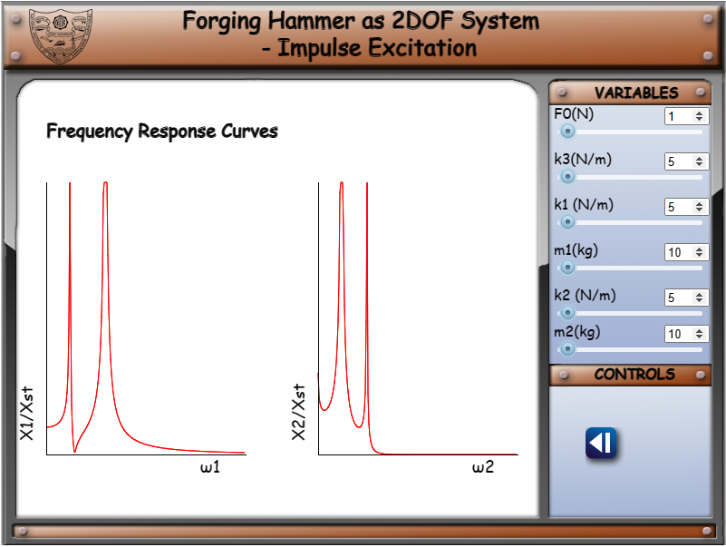

Given Data:
F0 - Impulse load acting on anvil (N) 
m1 - Mass of the base (kg)  
k1 - Stiffness of the base (N/m)  
m2 - Mass of the anvil (kg)  
k2 - Stiffness of the anvil (N/m)  

The response of the forge i.e m1 and m2 for different magnitudes of impulse forces F0 can be observed.

1. On clicking the simulation tab, the first page is displayed as shown below.

Here, the user can set F0 which will be the magnitude with which the hammer (animated red rectangle) will fall on the m2 and m1. The response of the system can be adjusted by varying k3, k1, m1, k2 and m2.

 
2. On clicking the next button, the mode shapes will be displayed, while the simulation is running.

 
3. The third page shows the frequency response curves.

