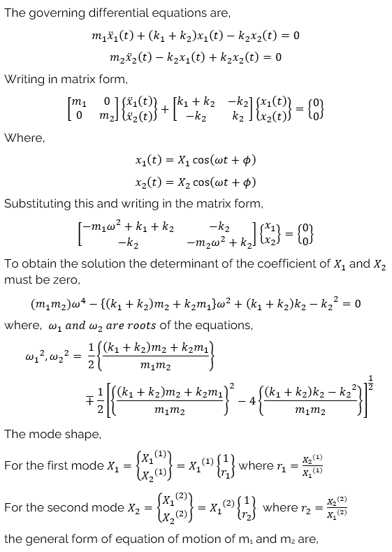
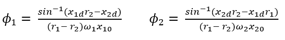

Impulse force can be defined as a force of large magnitude that acts for a short time. It can be measured by finding the change it causes in the momentum of system.
 

Impulse = F&delta;T = m \dot x2 - m \dot x1

The initial conditions are given by

x(t=0) = x0 = 0

\dot x(t=0) = \dot x0 = 1/m

Forging is a technology that is built using trial and error method over a period of time, it was an experience oriented technology. The hammer when used over a billet impresses an impulse force. The billet and mass absorb the mass and undergo displacement. For this experiment, the displacement of the masses are simulated when an impulse force is acted upon it.

The displacement for the masses are calculated as, X1 and X2, which are also the static amplitudes

 

The x1 and x2 are the dynamic amplitudes which is the cos function of time

the x10 and x20 is the initial amplitude

the x1d and x2d is the initial assumed velocity which is 0 in this case

